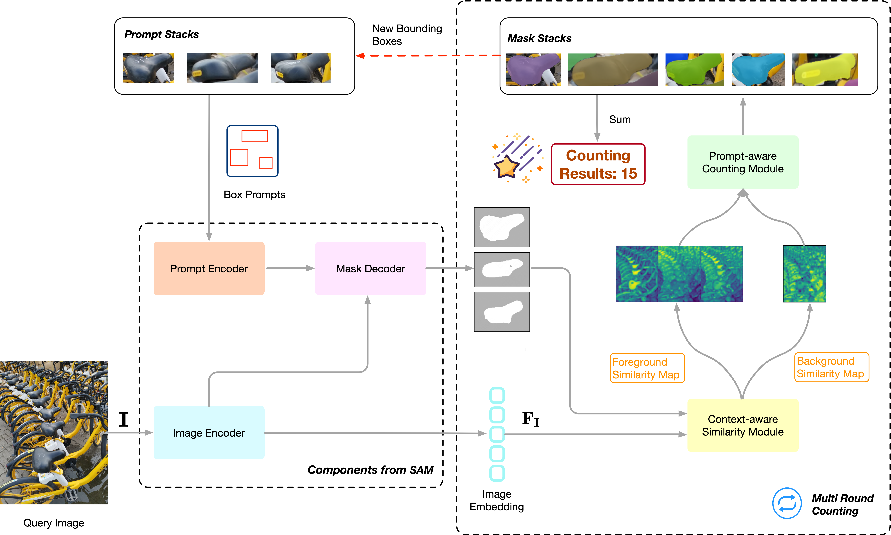
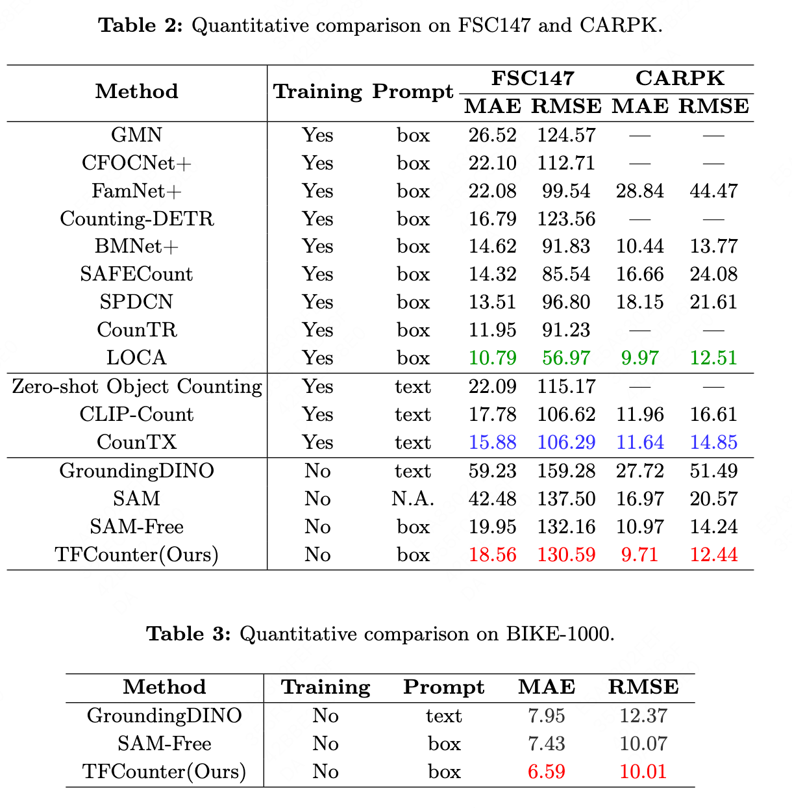

<h2>TFCounter: Polishing Gems for Training-Free Object Counting </h2>




<h2> Installation </h2>
1. The code requires python>=3.8, as well as pytorch>=1.7 and torchvision>=0.8. <br>
2. Please follow the instructions <a href="https://pytorch.org/get-started/locally/" target="_blank">here</a> to install both PyTorch and TorchVision dependencies. <br>
3. Installing both PyTorch and TorchVision with CUDA support is strongly recommended.


<h2> Getting Started </h2>
1. Download the <a href="https://dl.fbaipublicfiles.com/segment_anything/sam_vit_b_01ec64.pth" target="_blank">'vit_b'</a> pre-trained model of SAM and save it to the folder 'pretrain'. <br>
2. Download the <a href="https://drive.google.com/file/d/1QbaJdwpS3GfnjZBaUkEHqnTbAQeIA0Im/view?usp=drive_link" target="_blank">FSC-147</a> and <a href="https://drive.google.com/file/d/1NhIEza_vsrQ0HPZFM9byhXKvEH6wsNrg/view?usp=drive_link" target="_blank">CARPK</a> datasets and save them to the folder 'dataset' <br>
3. Run 


```
python main-fsc147.py --test-split='test' --prompt-type='box' --device='cuda:0'
```
or

```
python main-carpk.py --test-split='test' --prompt-type='box' --device='cuda:0'
```

or

```
python main-bike.py --test-split='test' --prompt-type='box' --device='cuda:0'
```

<h2> BIKE-1000 Dataset </h2>


<h2> Qualitative Results </h2>


<h2> Quantitative Results </h2>




<h2> Acknowledgment </h2>
We express our sincere gratitude to the brilliant minds behind <a href="https://github.com/facebookresearch/segment-anything" target="_blank">SAM</a> and <a href="https://github.com/shizenglin/training-free-object-counter" target="_blank">SAM-Free</a>, as our code builds upon theirs. 


<h2> Citing </h2>
If you use our code in your research, please use the following BibTeX entry.